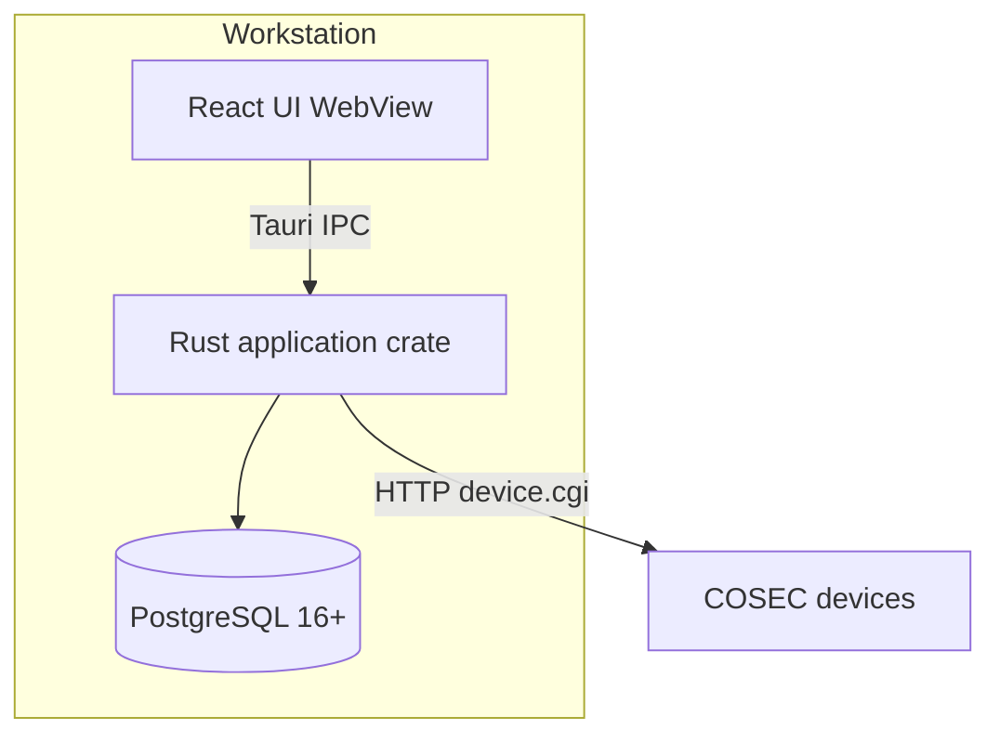

# C4 — Containers

One desktop process. Containers here are **logical**, not Docker.



| Container | Technology | Notes |
|---|---|---|
| React UI | TypeScript, Vite, Tauri WebView | `src/`. No SQL, no Matrix HTTP. |
| Rust crate | `vsmart_sync` / `vsmart_sync_lib` | `src-tauri/src/`: commands, domains, database, matrix. |
| PostgreSQL | Local install | Migrations in `migrations/`. |
| Devices | Vendor firmware | Not our process. |

## Inside the Rust crate

```
commands.rs          presentation/transport
domains/*            application + domain
database/*           persistence
matrix/*             device integration
common/*             small shared helpers
```

Details: [module-boundaries.md](module-boundaries.md), [overview.md](overview.md).
