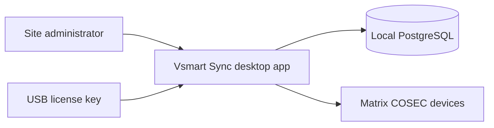

# C4 — System context

**Status:** Foundation. Domain features **PLANNED**.

| Element | Responsibility |
|---|---|
| Site administrator | Runs the workstation app. Manages users, devices, enrollment, sync, events. |
| Vsmart Sync | Tauri process: React UI + Rust modular monolith. System of record for **desired** access-control state. |
| Local PostgreSQL | Desired state, jobs, events, audit. Not Docker. Port 5432. |
| USB license | Proves the workstation may use protected features (**PLANNED**). Independent of door connectivity. |
| Matrix COSEC devices | Physical doors/controllers. Own user/credential stores. HTTP `device.cgi` (and TCP events per vendor guide). |

External systems we **do not** depend on in the MVP: COSEC Web, Centra, cloud identity, Redis, public internet APIs for the product itself.

See [overview.md](overview.md).
