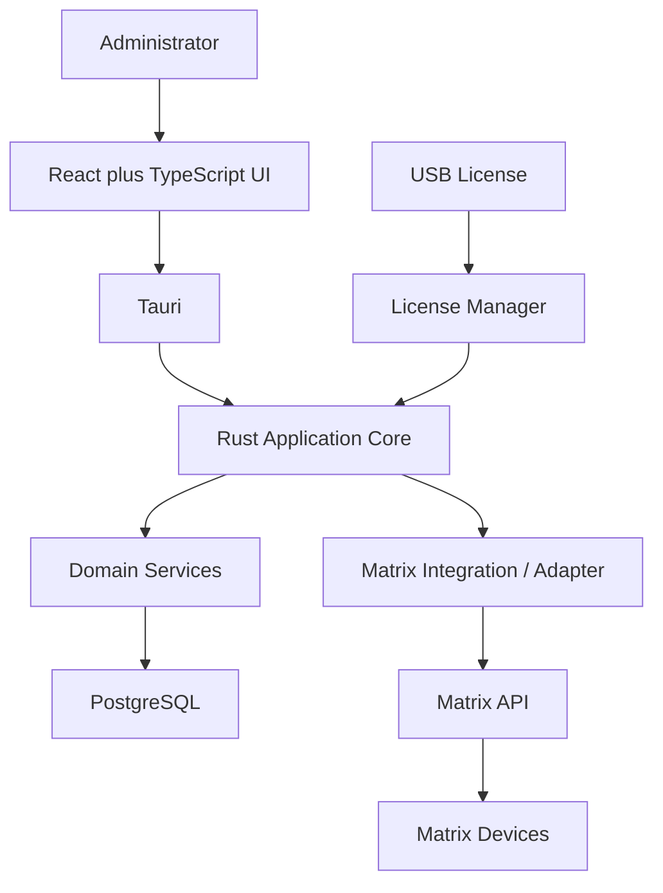

# Architecture

**Status:** The **layering and module layout** exist as a foundation. Domain services, the Matrix adapter implementation, USB licensing, and application tables are **PLANNED**.

## Style: modular monolith

Vsmart Sync is a **modular monolith**, not a set of microservices.

One Rust application crate (`src-tauri`, package `vsmart_sync`) owns all backend behavior. Domains are **modules inside that crate**, not separate deployable services. There is one PostgreSQL database, one desktop process, and no message bus, Redis, Kafka, or Kubernetes in the MVP.

The system is modular so that:

- Domain boundaries stay visible (`users`, `devices`, `events`, …)
- Each service can be implemented and reviewed in isolation
- Tests can target one module without standing up extra processes
- Features can be added without rewriting the core
- **Matrix-specific HTTP stays isolated** behind the Matrix integration layer

Do not introduce microservices unless that is explicitly requested later.

## Conceptual architecture



USB licensing is **independent** of Matrix communication. Losing the USB key must not be confused with a device going offline.

## Layers

### Frontend — React + TypeScript

**IMPLEMENTED:** Vite app, foundation page, `src/services` calling Tauri.

**Responsibility (planned):** screens for administration — users, devices, enrollment progress, sync status, events, monitoring.

**Must not:** open PostgreSQL, call Matrix HTTP, store device passwords, or enforce license checks in the UI.

All frontend access to the backend goes through a thin services layer that uses Tauri `invoke`.

### Tauri

**IMPLEMENTED:** window, command bridge, `get_app_info`.

**Responsibility:** host the WebView, expose a small command surface, manage application lifecycle.

**Must not:** contain domain rules or SQL.

### Rust application core

**IMPLEMENTED:** `lib.rs` startup, tracing, env loading, database pool on setup.

**Responsibility:** compose modules, load configuration, initialize PostgreSQL, register commands, apply license gates when licensing exists.

**Must not:** embed Matrix URL construction outside the Matrix module.

### Domain modules / services

**PLANNED** (placeholders exist: `auth`, `users`, `devices`, …).

**Responsibility:** business rules — create user, register device, plan sync, record events, write audit entries.

**Must not:** call `device.cgi` URLs directly. They talk to repositories and to **application abstractions** that the Matrix adapter implements.

### Database

**IMPLEMENTED:** config, pool, migrator. **PLANNED:** tables and repositories.

**Responsibility:** persist desired state, jobs, events, audit. Access only through the `database` layer / repositories.

**Must not:** be queried from React.

### Matrix adapter (our code)

**PLANNED** (empty `matrix/adapter`, `matrix/client`, `matrix/models`).

**Responsibility:** translate domain operations into COSEC Devices API calls, map responses into application types, handle HTTP basic authentication to the **device**, timeouts, and model-specific errors.

**Must not:** own user/device business rules or PostgreSQL schema.

### Matrix API (vendor)

HTTP CGI on the device itself:

```text
http://<deviceIP:deviceport>/device.cgi/<request-type>?<argument>=<value>
```

This is **provided by Matrix**, documented in the COSEC Devices API User Guide. Default device port in that guide is **80**. Authentication is **HTTP basic auth** (device username/password).

**REQUIRES MATRIX DOCUMENTATION VERIFICATION** for each device model: not every API or parameter is supported on every variant.

### Matrix devices

Physical COSEC door controllers / readers. They:

- Store users and credentials locally
- Perform access operations at the door (card, PIN, biometric, face — **model dependent**)
- Emit events (HTTP fetch and/or TCP stream)

The desktop application does **not** necessarily perform every real-time biometric match. Matching typically happens **on the device**. **REQUIRES MATRIX DOCUMENTATION VERIFICATION** per model.

### USB licensing

**PLANNED.** See [licensing.md](../licensing.md).

**Responsibility:** prove the workstation is authorized to run protected features.

**Must not:** live in React or be confused with Matrix login.

## Data and control rules

| Rule | Status |
|---|---|
| React → Rust only via Tauri commands | **IMPLEMENTED** for `get_app_info` |
| React never talks to PostgreSQL | **IMPLEMENTED** as a foundation rule |
| React never talks to Matrix devices | **IMPLEMENTED** as a foundation rule |
| Matrix credentials never returned to the UI | **PLANNED** enforcement; rule already stated |
| SQL only through the database layer | **IMPLEMENTED** as a foundation rule |
| Matrix HTTP only through the adapter | **PLANNED** (stubs exist) |
| Migrations version-controlled in `migrations/` | **IMPLEMENTED** (no table files yet) |

## Repository layout (foundation)

```text
src/                         React UI (pages, components/ui, layout, hooks, services, types)
src-tauri/src/
  commands.rs                Tauri IPC — the only path from React to Rust
  common/                    Shared helpers
  database/                  PostgreSQL config, pool, future models/repos
  domains/                   Business services (placeholders until implemented)
    auth, users, devices, credentials, enrollments
    synchronization, events, audit, licensing
  matrix/                    COSEC Devices API boundary
    adapter, client, models
migrations/                  SQLx migrations (empty of tables today)
docs/
  engineering/               Binding coding constitution
  architecture/              System design, C4, ADRs
  *.md                       Product / Matrix / setup
AGENTS.md                    Cursor/agent entry point
```

This layout is **IMPLEMENTED**. Domain modules under `domains/` are placeholders until each service is built.

## Why not call Matrix from everywhere?

The COSEC Devices API is HTTP query strings on `device.cgi`, with model-specific parameters and response codes. If domain services inlined those URLs:

- User/device logic would break when a model differs
- Tests would need real devices
- Credential blobs and device passwords would leak across layers

The adapter is the **only** place that is allowed to know `/device.cgi/users`, `/device.cgi/enrolluser`, and similar paths.
