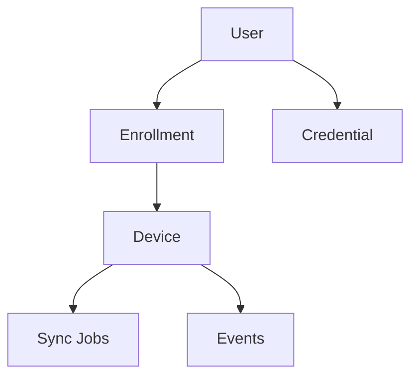

# Database

**Status:** PostgreSQL + SQLx + a **local** PostgreSQL install + migration **runner** are **IMPLEMENTED**. Application **tables are not created**. This file is the **planned** data architecture.

Do **not** treat entity names as a frozen schema. Final columns will be designed **before** each service is implemented.

## Engine and tooling

| Piece | Choice | Status |
|---|---|---|
| Database | PostgreSQL 16+ (local install, not Docker) | **IMPLEMENTED** |
| Access | SQLx (Rust), runtime Tokio, rustls | **IMPLEMENTED** |
| Migrations | SQLx files in repository-root `migrations/` | **IMPLEMENTED** (empty of `.sql` table migrations) |
| Dev host port | **5432** | **IMPLEMENTED** |

There is no migrate-only npm script. The app runs `connect_and_migrate` at startup. Live check: `cargo test --manifest-path src-tauri/Cargo.toml -- --ignored`.

## Planned entities

These names are **conceptual**. They will become tables (and possibly extra join tables) after a schema design pass.

| Entity | Purpose |
|---|---|
| `users` | People in the application desired state |
| `devices` | Registered COSEC doors / controllers |
| `credentials` | Credential records belonging to users |
| `enrollments` | Enrollment sessions (not the same as a stored credential) |
| `sync_jobs` | Units of work to push/reconcile state to a device |
| `events` | Device-reported history (seq + rollover, payload) |
| `audit_logs` | Actions taken **in this application** |

Supporting tables (license state, admin accounts, access-setting profiles, per-device cursor for events) may appear later. **Not invented as final columns here.**

## Conceptual relationships

In words:

- A **user** may have many **credentials**.
- An **enrollment** is a session that involves a **user** and a **device** (and usually produces or updates a **credential**).
- A **device** has many **sync jobs** and many **events**.
- **Audit logs** attach to an actor (future admin identity) and an action; they are not device events.

Device-side identifiers (`user-id`, `ref-user-id`, event `seq-number`) are **vendor fields**. Application rows should still use **internal UUIDs**. How those map is part of schema design, not this document’s column list.

## Design rules (when tables are added)

| Rule | Intent |
|---|---|
| UUID internal identifiers | Stable primary keys in *this* application |
| UTC timestamps | Created/updated/occurred-at stored in UTC |
| Foreign keys | Users/devices/jobs stay referentially consistent |
| Uniqueness | Prevent duplicate device addresses, duplicate event keys per device, duplicate user-device mappings as designed |
| Indexes | Lookups by device, user, event time, job status |
| Transactions | Multi-row updates (user + credential + job) commit or roll back together |
| Migrations | One versioned SQL file per change; never hand-edit production catalogs |
| Secrets | Device passwords / template blobs: encryption and column choices **to be designed**; never in git |

## What we will not do in this documentation pass

- Invent final column names, types, or CHECK constraints
- Create `.sql` migration files
- Copy Matrix XML field lists into PostgreSQL 1:1 without a mapping design

Event rows will need enough data to **deduplicate** (`device` + `roll-over-count` + `seq-number` is the vendor key described in the API guide). Exact table shape is still **PLANNED**.

## SQLx notes for implementers

- Migration files belong in `migrations/` at the **repository root** (already documented in `src-tauri/src/database/mod.rs`).
- Compile-time query macros, if used later, must not require inventing schema here.
- `DATABASE_URL` format is in [getting-started.md](getting-started.md).
