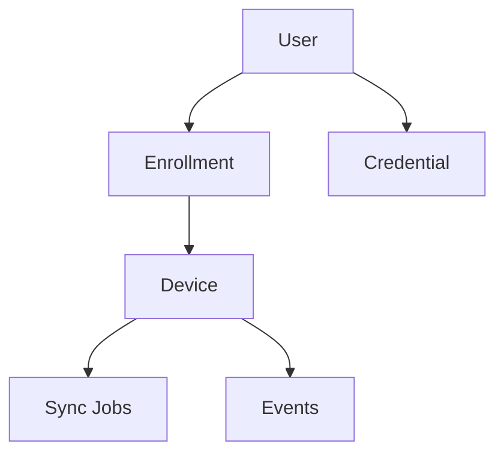

# Database

**Status:** PostgreSQL + SQLx + a **local** PostgreSQL install + migration **runner** are **IMPLEMENTED**. The `users` and `devices` tables are **IMPLEMENTED**. Other application **tables are not created**. Do **not** treat remaining entity names as a frozen schema.

## Engine and tooling

| Piece | Choice | Status |
|---|---|---|
| Database | PostgreSQL 16+ (local install, not Docker) | **IMPLEMENTED** |
| Access | SQLx (Rust), runtime Tokio, rustls | **IMPLEMENTED** |
| Migrations | SQLx files in repository-root `migrations/` | **IMPLEMENTED** (`0001_create_users.sql`, `0002_create_devices.sql`, `0003_create_credentials.sql`) |
| Dev host port | **5432** | **IMPLEMENTED** |

There is no migrate-only npm script. The app runs `connect_and_migrate` at startup. Live check: `cargo test --manifest-path src-tauri/Cargo.toml -- --ignored`.

## Users table (IMPLEMENTED)

Migration `migrations/0001_create_users.sql`. UUID is the only unique key. Do not add Matrix or credential columns here.

| Column | Type | Rules |
|---|---|---|
| `id` | UUID | PRIMARY KEY |
| `name` | TEXT | NOT NULL, trimmed non-empty, max 200 chars |
| `status` | TEXT | NOT NULL, `active` or `inactive` only |
| `created_at` | TIMESTAMPTZ | NOT NULL |
| `updated_at` | TIMESTAMPTZ | NOT NULL |

No unique constraint on `name`. No `matrix_user_id`, `employee_code`, `card_number`, `device_id`, or biometric columns.

## Devices table (IMPLEMENTED)

Migration `migrations/0002_create_devices.sql`. Unique on `(host, port)`. Password is stored only as ciphertext (see ADR-009).

| Column | Type | Rules |
|---|---|---|
| `id` | UUID | PRIMARY KEY |
| `name` | TEXT | NOT NULL, trimmed non-empty, max 200 chars |
| `host` | TEXT | NOT NULL, hostname or IPv4 only (validated in Rust) |
| `port` | INTEGER | NOT NULL, 1–65535, default 80 |
| `username` | TEXT | NOT NULL, non-empty, max 100 chars |
| `password_ciphertext` | BYTEA | NOT NULL, AES-256-GCM blob; never returned to React |
| `connection_status` | TEXT | NOT NULL, `unknown` / `online` / `offline` (app reachability) |
| `last_seen_at` | TIMESTAMPTZ | NULL; set only on successful connection test |
| `created_at` | TIMESTAMPTZ | NOT NULL |
| `updated_at` | TIMESTAMPTZ | NOT NULL |

Do not add enrollment, sync, biometric, Matrix user-id, licensing, or event columns here.

## Credentials table (IMPLEMENTED)

Migration `migrations/0003_create_credentials.sql`. Application system of record only — no Matrix IDs.

| Column | Type | Rules |
|---|---|---|
| `id` | UUID | PRIMARY KEY |
| `user_id` | UUID | NOT NULL, FK → `users(id)` |
| `type` | TEXT | NOT NULL, `card` or `pin` only (MVP; biometrics deferred) |
| `value_ciphertext` | BYTEA | NOT NULL, AES-256-GCM; never returned to React |
| `value_digest` | BYTEA | NOT NULL, SHA-256 for uniqueness without plaintext |
| `display_hint` | TEXT | NULL; last-4 mask for cards only; always NULL for PIN |
| `status` | TEXT | NOT NULL, `active` or `inactive` |
| `created_at` | TIMESTAMPTZ | NOT NULL |
| `updated_at` | TIMESTAMPTZ | NOT NULL |

Indexes: `user_id`, `status`, `type` (list filters). Partial unique: one digest per card globally; one PIN per user.

## Planned entities

These names are **conceptual**. They will become tables (and possibly extra join tables) after a schema design pass.

| Entity | Purpose | Status |
|---|---|---|
| `users` | People in the application desired state | **IMPLEMENTED** |
| `devices` | Registered COSEC doors / controllers | **IMPLEMENTED** |
| `credentials` | Credential records belonging to users | **IMPLEMENTED** |
| `enrollments` | Enrollment sessions (not the same as a stored credential) | **PLANNED** |
| `sync_jobs` | Units of work to push/reconcile state to a device | **PLANNED** |
| `events` | Device-reported history (seq + rollover, payload) | **PLANNED** |
| `audit_logs` | Actions taken **in this application** | **PLANNED** |

Supporting tables (license state, admin accounts, access-setting profiles, per-device cursor for events) may appear later. **Not invented as final columns here.**

## Conceptual relationships

In words:

- A **user** may have many **credentials**.
- An **enrollment** is a session that involves a **user** and a **device** (and usually produces or updates a **credential**).
- A **device** has many **sync jobs** and many **events**.
- **Audit logs** attach to an actor (future admin identity) and an action; they are not device events.

Device-side identifiers (`user-id`, `ref-user-id`, event `seq-number`) are **vendor fields**. Application rows should still use **internal UUIDs**. How those map is part of schema design, not this document’s column list.

## Design rules (when tables are added)

| Rule | Intent |
|---|---|
| UUID internal identifiers | Stable primary keys in *this* application |
| UTC timestamps | Created/updated/occurred-at stored in UTC |
| Foreign keys | Users/devices/jobs stay referentially consistent |
| Uniqueness | Prevent duplicate device addresses, duplicate event keys per device, duplicate user-device mappings as designed |
| Indexes | Lookups by device, user, event time, job status |
| Transactions | Multi-row updates (user + credential + job) commit or roll back together |
| Migrations | One versioned SQL file per change; never hand-edit production catalogs |
| Secrets | Device passwords / template blobs: encryption and column choices **to be designed**; never in git |

## What we will not do in this documentation pass

- Invent final column names, types, or CHECK constraints
- Create `.sql` migration files
- Copy Matrix XML field lists into PostgreSQL 1:1 without a mapping design

Event rows will need enough data to **deduplicate** (`device` + `roll-over-count` + `seq-number` is the vendor key described in the API guide). Exact table shape is still **PLANNED**.

## SQLx notes for implementers

- Migration files belong in `migrations/` at the **repository root** (already documented in `src-tauri/src/database/mod.rs`).
- Compile-time query macros, if used later, must not require inventing schema here.
- `DATABASE_URL` format is in [getting-started.md](getting-started.md).
