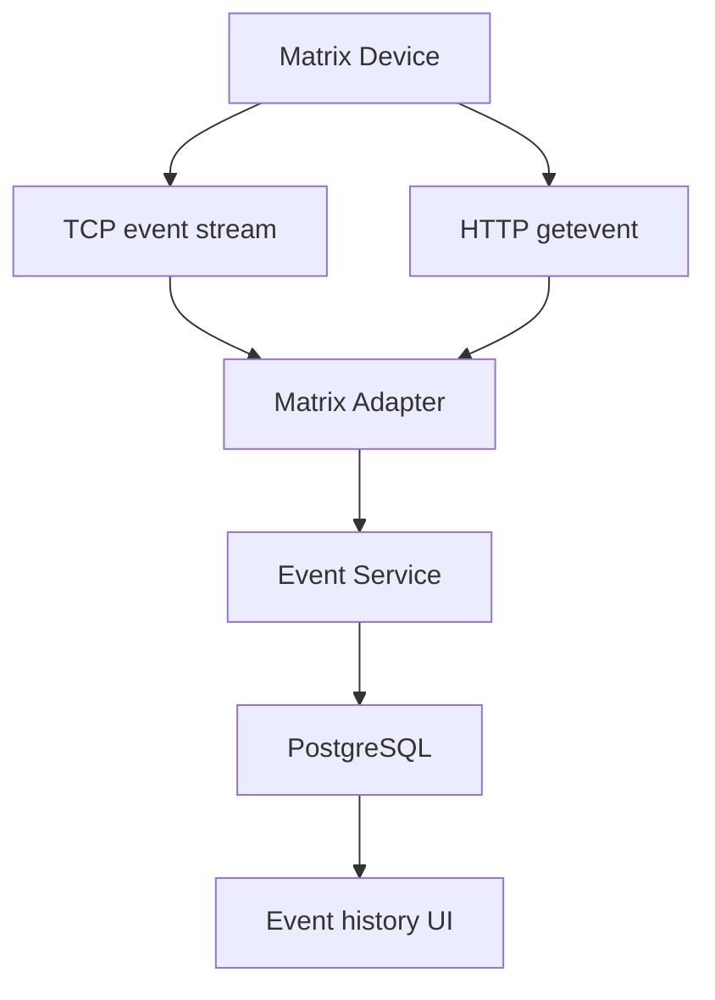
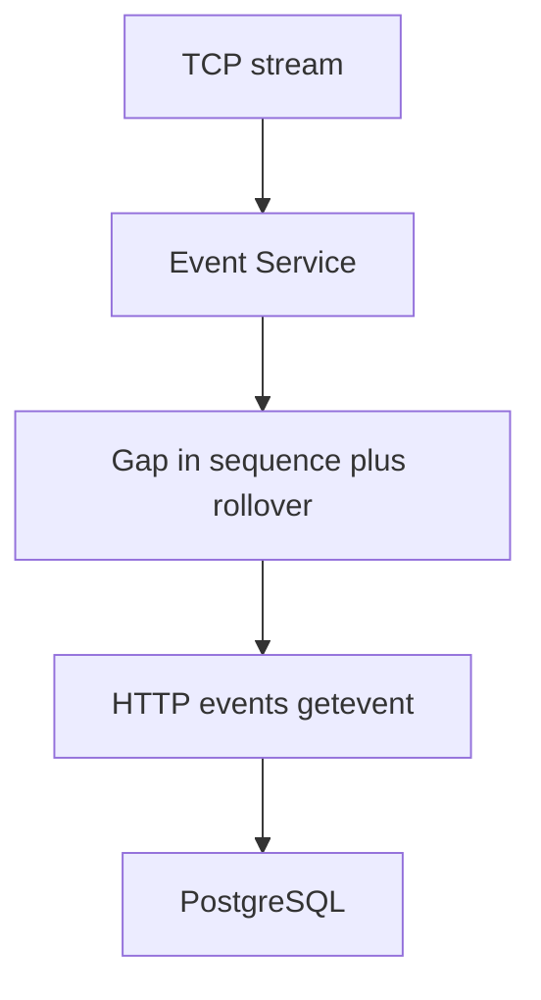

# Events

**Status:** **PLANNED.** The `events` module is a placeholder. Facts below are from the COSEC Devices API User Guide v28 unless marked for verification.

## What an event is

An **event** is a **record the device already produced**: access allowed/denied, enrollment activity, alarm, system message, and other codes listed in the guide appendix.

It is **not**:

| Term | Meaning |
|---|---|
| **Event** | Historical fact reported by the device (`event-id`, details, time, seq). |
| **Command** | An API the application sends (`lockdoor`, `geteventcount`, `enrolluser`, …). |
| **Access decision** | The door controller deciding whether to grant entry **at the hardware**. |

Typical path:

```text
Person presents credential
    → Matrix device performs the access operation
    → Access result occurs at the door
    → Device reports an event
    → Application stores the event
```

This desktop application does **not** necessarily perform every real-time biometric match. Matching is expected to occur **on the device**. **Requires verification against the specific Matrix device model/API documentation** for a given reader/biometric engine.

## Architecture (planned)



## Real-time collection (TCP)

Verified API:

```text
http://<deviceIP:deviceport>/device.cgi/tcp-events?action=getevent&ipaddress=<app>&port=<listen>&roll-over-count=<n>&seq-number=<n>
```

The application (or a helper listener) is the **TCP server**; the device **pushes** events.

Guide notes:

- `trigger` start/stop; `keep-live-events` continuous vs limit
- `ipaddress` and `port` are **mandatory** in the parameter table
- `roll-over-count` and `seq-number` required unless `keep-live-events=1` (per that table)
- Default TCP ACK is used to send the **next** event
- **Not supported on Direct Door V2**
- If the device **reboots** during transfer, the prior send-events command is **invalid**; the client must re-request
- User id on the event is the numeric **reference id**

Exact TCP payload framing beyond the HTTP setup call **Requires verification against the specific Matrix device model/API documentation.**

## HTTP retrieval and recovery

Verified API:

```text
http://<deviceIP:deviceport>/device.cgi/events?action=getevent&roll-over-count=<n>&seq-number=<n>&no-of-events=<k>
```

`roll-over-count` and `seq-number` are **mandatory**. They identify the **first** event of the batch.

`no-of-events` limits (guide table):

- 1–5: Direct Door V2, Path Controller, IO Controller
- 1–100: other Direct Doors listed there

Response examples include XML with `roll-over-count`, `seq-No`, `date`, `time`, `event-id`, `detail-1` … `detail-5`. Detail field meaning **depends on event type and device**; see the guide appendix. **Requires verification against the specific Matrix device model/API documentation.**

### Missed TCP events (verified policy)

If an event is missed on TCP, the **third party** must re-request it. That **must not** use the TCP port. Missed events are recovered with the **HTTP** event API.



## Sequence numbers and rollover

| Field | Guide |
|---|---|
| `seq-number` | Per-device range (examples: V2 1–50,000; several models up to 500,000) |
| `roll-over-count` | `0–65535`; used together with seq when the seq space wraps |

`geteventcount` (`/device.cgi/command?action=geteventcount`) returns the device’s **current** sequence number and roll-over count (XML example in the guide). Useful for catching up and for monitoring.

When seq wraps, **both** fields are required to order events. Application storage should treat `(device, roll-over-count, seq-number)` as the vendor identity for deduplication.

## Duplicate protection (planned)

TCP retry, HTTP overlap, and crash recovery can deliver the same event twice. The event service should insert **idempotently** on the vendor key (and ignore duplicates). Do not invent extra uniqueness until the schema pass.

## Event persistence and history (planned)

PostgreSQL `events` (conceptual) stores:

- Device identity (application UUID)
- Rollover + sequence
- Timestamp **as reported** plus `ingested_at` UTC
- `event-id` and detail fields
- Raw payload optional (for forward compatibility)

The React UI reads **through Rust**, never from the device.

## Cursor / catch-up (planned)

Per device, persist the last **successfully stored** (rollover, seq). On startup:

1. Optionally `geteventcount`
2. Resume TCP from next seq if the model supports it
3. HTTP-fill any gap

## Event configuration appendix

The guide’s appendix lists user events, alarm events, system events, cafeteria events, and field encodings. This project will **not** copy that table into code until a service implements parsing. Until then, unknown `event-id` values are stored, not guessed.

## Out of scope for this document

- Claiming the desktop app is in the biometric matching loop
- Using TCP to fill missed events
- Treating `geteventcount` as a list of events (it is current seq + rollover)
