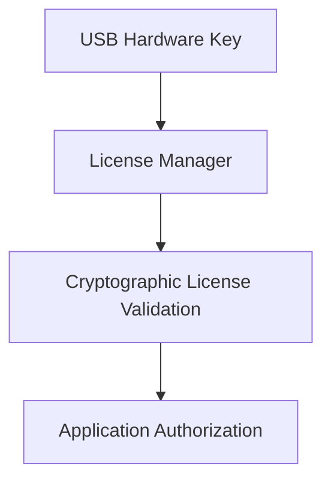
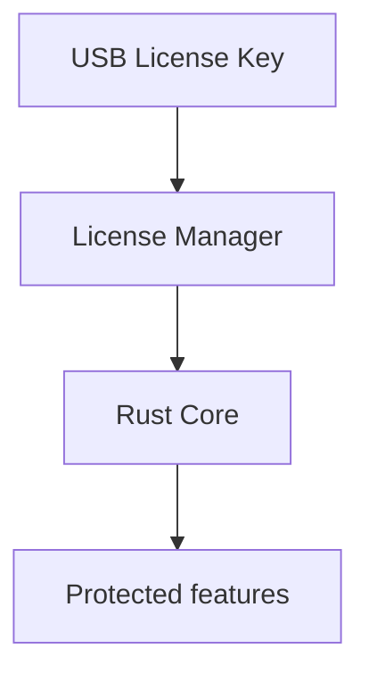

# USB licensing

**Status:** **NOT implemented.** The `licensing` module is a placeholder. USB licensing is **planned architecture** for this product. It is **not** part of the Matrix COSEC Devices API.

Do not treat the diagrams below as existing behavior.

## Independent of Matrix

USB licensing authorizes the **workstation application**.

Matrix HTTP basic auth authorizes calls to a **door**.

They must not share secrets, modules, or failure modes. A pulled USB key is not “device offline.” A device timeout is not “license invalid.”

Runtime placement:

React only displays **state** (present / missing / error). It never contains license secrets, private keys, or vendor challenge bytes.

## Planned responsibilities

| Component | Owns |
|---|---|
| USB hardware key | Vendor-supplied token plugged into the PC |
| License manager (`licensing`) | Detect insertion/removal, run validation, expose a Rust API |
| Cryptographic validation | Prove the key is genuine and in policy (algorithm **not chosen** in this document) |
| Rust core | Allow or refuse **protected operations** based on license state |
| React | Human-readable license status only |

## Planned runtime policy

- Validate in **Rust**, on the host, not in the WebView.
- If the key is **removed** at runtime, handle it **gracefully**: stop protected mutations, keep a clear UI message, do not crash the process if avoidable.
- Protected operations (exact list **PLANNED**) can lock when the license is unavailable — for example sync, enrollment, device commands.
- Read-only event history **may** remain available; that decision is part of implementation review, not a current claim.
- Startup may show a blocking license screen before full admin tools. **Not built.**

## What must not happen

- License private material in `src/`, git, or logs
- Trusting a frontend boolean (`isLicensed`) as security
- Calling Matrix to “activate” the USB key
- Shipping a hardcoded bypass in production builds

## Implementation status

**Full USB licensing implementation is NOT currently implemented.**

The foundation only reserves `src-tauri/src/domains/licensing/`. Vendor SDK, key format, crypto, and Windows/macOS USB handling are **future work** (see [development.md](development.md) sequence item 11).

Until then, `npm start` does **not** require a USB dongle.
