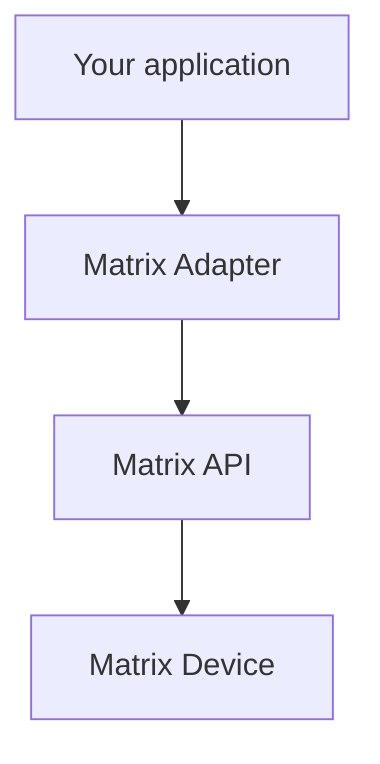

# Matrix integration

**Status:** Adapter/client/model **stubs exist**. No HTTP calls are **IMPLEMENTED**. This document uses only behavior verified in **COSEC Devices API User Guide, Version 28 (30 October 2025)**.

## Adapter vs API



| Term | Who owns it |
|---|---|
| **Matrix Adapter** | **Our** Rust code (`src-tauri/src/matrix/`). Translates domain operations to HTTP/TCP. |
| **Matrix API** | **Matrix**. CGI on the device: `device.cgi`. |
| **Matrix Device** | Physical COSEC controller / door. |

Do not invent undocumented endpoints. If the guide does not establish exact behavior for a model, this project will mark it:

**Requires verification against the specific Matrix device model/API documentation.**

The guide itself is **general for all variants**. A product **may not support** every feature described.

## How the vendor API works (verified)

- Transport: HTTP request/response (plain HTTP in the guide; default port **80**, any port may be used).
- URL shape:

```text
http://<deviceIP:deviceport>/device.cgi/<request-type>?<argument>=<value>&<argument>=<value>
```

- Mandatory CGI directory: `device.cgi`.
- Common argument: `action` (`get`, `set`, `delete`, `enroll`, `getdefault`, `setdefault`, …).
- Most commands use the **GET** method with arguments in the URL; **POST** only where the guide says so (body parameters).
- Response body: **text** (default) or **XML** when `format=xml`.
- Authentication: device requests **HTTP basic authentication**. The guide’s default username is `admin`; password is **the password set on the device**.
- Client flow: check device availability → send request → device parses action → error (4xx) or success (2xx) with body.

Special characters `& ' " < > # % ;` are not allowed inside argument values ( `&` separates arguments).

## Supported device families (guide list)

The guide lists APIs as depending on device type, including:

- COSEC Direct Door V2 / V3 / V4
- COSEC Path Controller
- COSEC Wireless Door
- COSEC NGT Door
- COSEC PVR Door
- COSEC Vega Controller
- COSEC Argo Controller
- COSEC ARC Controller
- COSEC Door FMX
- COSEC ARGO FACE Door

Support of a given path or parameter **Requires verification against the specific Matrix device model/API documentation.**

## Currently relevant API areas (MVP-oriented)

Verified paths and actions:

| Area | Path | Notes from the guide |
|---|---|---|
| Device | `/device.cgi/device-basic-config` | Actions include `get`, `set`, `getdefault`, `setdefault`. Name, application type, ASC, max fingers, etc. |
| Users | `/device.cgi/users` | `get` / `set` configuration; `delete` removes the user **and credentials** on the device. Creating a user requires `user-id` and `ref-user-id`. |
| Credentials | `/device.cgi/credential` | `set` / `get` / `delete`. Types include finger, card, palm, face (face types ARGO FACE). Data may travel in the request/response body. |
| Enrollment | `/device.cgi/enrolluser` | `action=enroll`. Starts capture on the device; **does not** replace get/set credential. |
| Access settings | `/device.cgi/access-setting` | `get` / `set` / defaults. Weekdays and work start/end times in the documented parameter table. |
| Events (HTTP) | `/device.cgi/events?action=getevent` | Requires `roll-over-count` and `seq-number`. Optional `no-of-events` (limits **depend on device type**). |
| Events (TCP) | `/device.cgi/tcp-events?action=getevent` | Device sends events to `ipaddress` + `port`. **Not supported on Direct Door V2** (memory). |

### Commands (same CGI, `command` request-type)

```text
http://<deviceIP:deviceport>/device.cgi/command?action=<value>
```

Verified actions relevant to this project:

| Action | Guide description |
|---|---|
| `getusercount` | Total number of users on the device |
| `getcount` | Enrolled template/credential **counts for a user** |
| `geteventcount` | Current event **sequence number** and **roll-over count** |

`getcount` is **not** a global inventory; it is per-user credential counts (`user-id` mandatory in the getcount parameter table).

## Phase 2 APIs (planned later; still verified paths)

These exist in the guide. They are **not** MVP commitments. Model applicability varies.

| Topic | Path / action |
|---|---|
| Reader configuration | `/device.cgi/reader-config` |
| Enrollment configuration | `/device.cgi/enroll-options` |
| Alarm configuration | `/device.cgi/alarm` |
| Lock door | `/device.cgi/command?action=lockdoor` |
| Unlock door | `/device.cgi/command?action=unlockdoor` |
| Normalize door | `/device.cgi/command?action=normalizedoor` |
| Clear alarm | `/device.cgi/command?action=clearalarm` |
| Acknowledge alarm | `/device.cgi/command?action=acknowledgealarm` |
| Deny user | `/device.cgi/command?action=denyuser` |

The guide marks **lock/unlock/normalize/open door** as **not applicable for ARGO FACE200T**. Other parameters (OSDP, palm, face) are device-specific.

**Requires verification against the specific Matrix device model/API documentation.**

## Enrollment vs credential HTTP (verified)

- `enrolluser` = command the device to **begin** enrollment; person interacts with hardware.
- Default enroll count is one if count is omitted.
- Retrieving a captured credential uses **credential get/set**, not the enroll response body (guide note).

See [system-flow.md](system-flow.md).

## Events (verified constraints)

- Identify events with **roll-over-count** (`0–65535`) and **seq-number** (range depends on door; e.g. V2 1–50,000, some models up to 500,000).
- HTTP `no-of-events`: 1–5 on Direct Door V2 / Path Controller / IO Controller; 1–100 on other Direct Doors listed in that table.
- Missed TCP events: third party must re-request; **not via TCP**; use the **HTTP** event API.
- After reboot during TCP transfer, the previous send-events command is invalid; client must re-request.
- User id on stored events is the **numeric reference id** (max 8 digits), not the alphanumeric user-id.

Batch sizes, TCP `keep-live-events`, `trigger` start/stop, and `response-time` details are in the guide. Implementing them **Requires verification against the specific Matrix device model/API documentation.**

## What the adapter must not do

- Expose device basic-auth passwords to React
- Spread CGI URLs into `users` / `devices` / UI
- Assume one API covers all COSEC models
- Invent a vendor “sync all users” endpoint (there isn’t one in the guide)

## Error handling

The guide documents HTTP status classes and a table of **API response codes** (body `Response-Code=0` appears in success examples). Mapping those codes into application errors is **PLANNED**. Treat unknown codes as **Requires verification against the specific Matrix device model/API documentation.**

## Authentication reminder

Device HTTP basic auth ≠ desktop `auth` module ≠ USB license. Three different secrets, three different modules.
