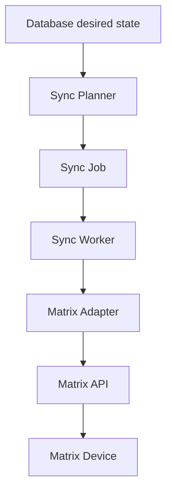

# Synchronization

**Status:** **PLANNED.** The `synchronization` Rust module is a placeholder. Matrix has **no** single “sync” endpoint in the COSEC Devices API guide.

## Why synchronization exists

PostgreSQL holds the **desired state** (who should exist, which credentials, which access settings). Each Matrix device holds its **own** user/credential/config store.

Administrators edit the application, not twenty CGI forms. The application must **push and reconcile** that desired state onto devices using the individual APIs (`/users`, `/credential`, `/access-setting`, deletes, and so on).

If every UI save called the device immediately, a single offline door would block the administrator, and partial updates would be hard to retry. Jobs make that work **explicit**.

## Concept

| Piece | Role |
|---|---|
| **Desired state** | Rows in PostgreSQL: users, credentials, access settings, assignments to devices. |
| **Device state** | What the door actually has (last known, or read back via get APIs). |
| **Sync planner** | Diff desired vs device (or vs last successful job); enqueue work. |
| **Sync job** | One durable unit: e.g. “upsert user X on device Y”, “delete credential Z”. |
| **Sync worker** | Picks jobs, calls the adapter, records results. |

Workers never call `device.cgi` themselves; they call the **adapter**.

## Job status machine (planned)

| Status | Meaning |
|---|---|
| `pending` | Persisted, waiting for a worker |
| `processing` | Claimed; in-flight HTTP |
| `success` | Adapter reported success; desired change considered applied |
| `failed` | Not retrying (validation, unsupported model, auth rejected, exhausted retries) |
| `retry` | Transient failure; eligible after backoff |

Exact persistence of `retry` vs `pending` + `next_attempt_at` will be chosen with the schema. Do not implement yet.

## Retry and backoff (planned)

- Retry timeouts, connection resets, and other transient HTTP failures.
- Do **not** blindly retry operations the guide treats as non-idempotent without a plan (enrollment sessions are a poor default retry).
- Exponential backoff with a cap; surface last error on the device record.
- Device reboot during operations: the event guide notes TCP subscriptions die on reboot; treat device reboot as “re-plan / re-subscribe,” not as a silent success.

Numeric backoff intervals are **not** specified here.

## Per-device concurrency (planned)

Run **at most one mutating job pipeline per device** (or a small documented limit) so CGI commands do not interleave in undefined ways. The guide does not define a device-side transaction across users + credentials.

Reads (geteventcount, monitoring) may be allowed concurrently if later design proves it safe. **Requires verification against the specific Matrix device model/API documentation.**

## Idempotency (planned)

Workers may crash after the device applied a change but before PostgreSQL recorded `success`. Replaying a job must not corrupt device state:

- User `set` against an existing `user-id` **updates** that user (guide).
- Deletes should tolerate “already gone” if the adapter can detect it (**response-code mapping REQUIRES MATRIX DOCUMENTATION VERIFICATION**).
- Enrollment `enrolluser` is **not** a good automatic replay (it starts a physical capture).

Prefer job keys that include device id + operation + subject id.

## Reconciliation (planned)

Periodically (or after failures):

1. Read selected device state (`users` get, `getusercount`, `getcount`, `geteventcount`, …)
2. Compare to desired state
3. Enqueue compensating jobs

Reconciliation is how the application notices manual changes on the device or dropped jobs. It is **application logic**, not a vendor sync call.

## What Matrix does not provide

Verified: configuration, users, credentials, enrollment, events, and discrete commands.

Not found in the guide as a single operation: “replace entire device database from this JSON.” Do not document or implement a fictional `/sync` CGI.

## Relation to other modules

- **Does not** replace event collection (events are history, not desired state).
- **Does not** replace audit (audit is who clicked Sync).
- Uses **devices** for connection data and **matrix** for HTTP.
