# System flow

**Status:** Every flow in this file is **PLANNED** unless noted. Startup through PostgreSQL and `get_app_info` is **IMPLEMENTED** at foundation level; USB license checks are **not**.

These diagrams are the target design. They are not a description of running code.

---

## A. Application startup

**IMPLEMENTED today (without USB license):** Tauri process → Rust core → load `.env` → PostgreSQL connect and migrate → window ready.

**PLANNED:** USB license validation before protected features.

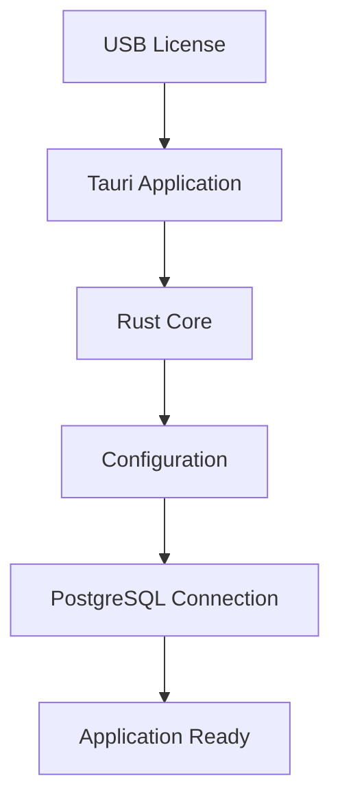

If the license key is missing, the core should still be able to show a clear “license required” state. Exact lock vs. read-only behavior is **PLANNED**. See [licensing.md](licensing.md).

---

## B. User creation

Administrator work stays in PostgreSQL first. Pushing the user to hardware is a **later sync** (section E), not a hidden Matrix call from the form.

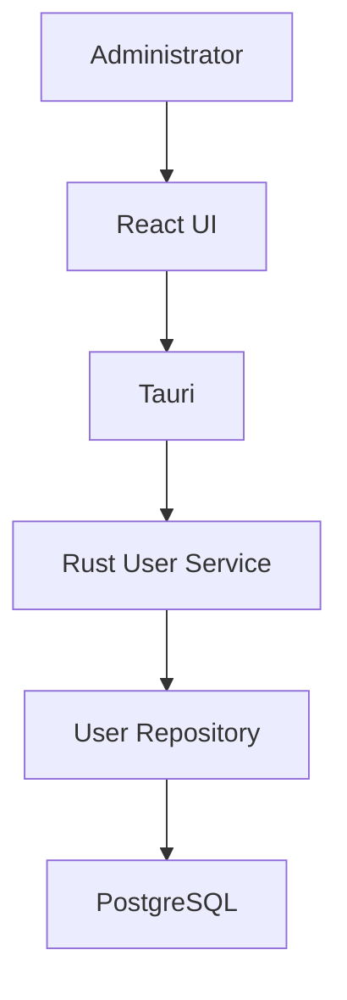

---

## C. Device registration

Registration stores how **this application** reaches the door. An optional Matrix read can confirm the device.

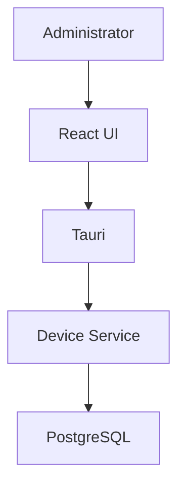

Then, when the service talks to hardware:

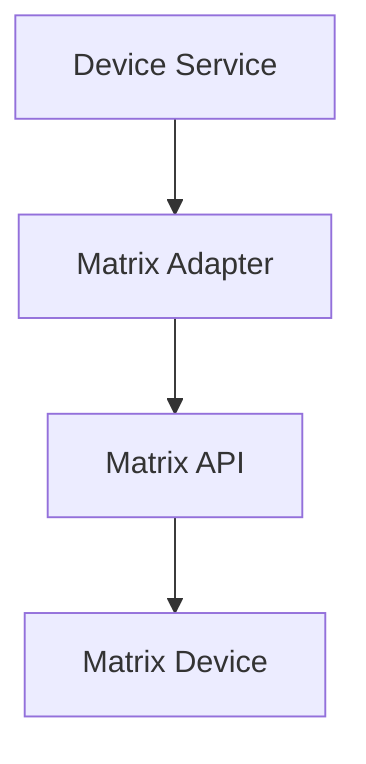

Typical confirmation call (verified): `GET /device.cgi/device-basic-config?action=get`. Device passwords stay in Rust.

---

## D. Enrollment

### Enrollment session vs credential provisioning

These are **different operations** in the COSEC Devices API guide.

| Concept | What it does | Verified API |
|---|---|---|
| **Enrollment session** | Tells the **device** to start capturing a live credential (card, finger, palm, face, etc.). The person must present themselves at the reader. | `/device.cgi/enrolluser?action=enroll` |
| **Credential provisioning** | HTTP **set/get/delete** of credential data (templates, card numbers) already known to the application or retrieved after capture. | `/device.cgi/credential?action=set\|get\|delete` |

The API guide states that enrolluser **only sends the enrollment command**. If the credential must be retrieved, that is done **explicitly** with get/set credential. Do not assume enrolluser also downloads templates in the same response.

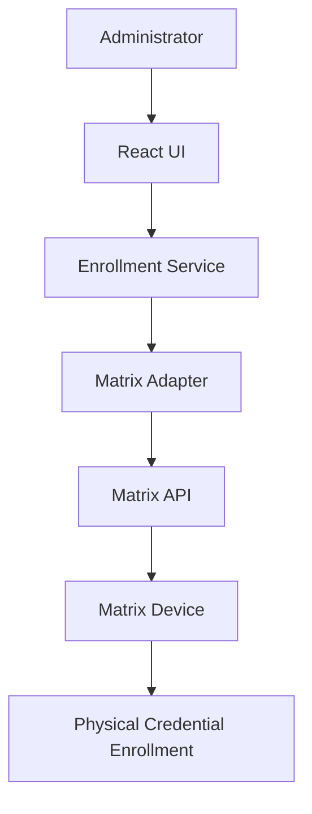

Outcome (success, failure, which fingers/cards) often appears as **device events** (for example enrollment-related event IDs in the API appendix). Parsing those fields **REQUIRES MATRIX DOCUMENTATION VERIFICATION** per model.

Unsupported Matrix behavior is **not** assumed: this application will not invent a combined “enroll and return template” endpoint.

---

## E. Synchronization

**PLANNED.** There is no single Matrix sync URL. The application compares desired state in PostgreSQL with what it last applied (and/or what it reads back) and enqueues jobs.

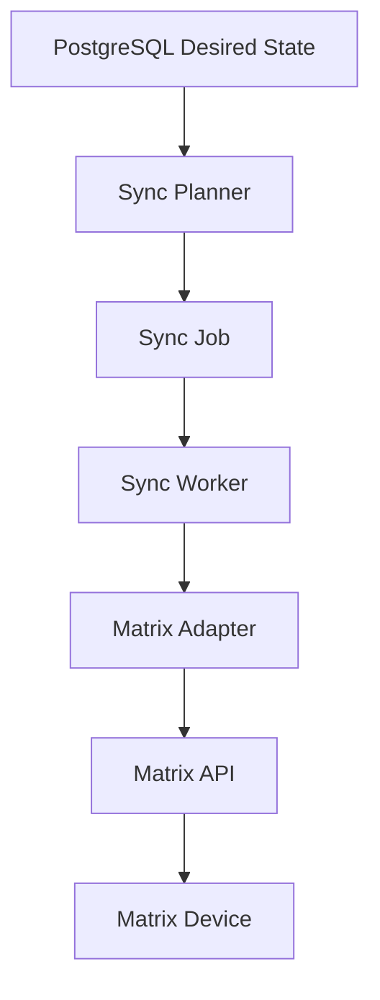

Job statuses (**PLANNED**):

| Status | Meaning |
|---|---|
| `pending` | Created, not started |
| `processing` | A worker holds the job |
| `success` | Adapter reported success for that unit of work |
| `failed` | Exhausted retries or non-retryable error |
| `retry` | Transient failure; wait backoff then pending/processing again |

Idempotency, per-device concurrency, and reconciliation are specified in [synchronization.md](synchronization.md). **Do not implement these yet.**

---

## F. Device monitoring

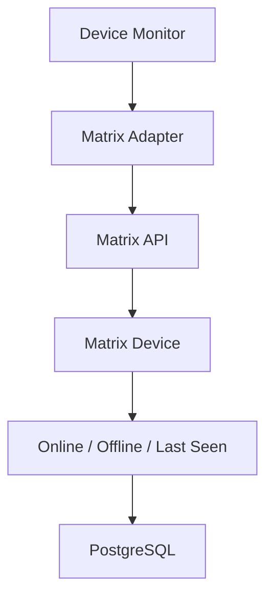

The exact probe (basic-config get, `geteventcount`, TCP session, ICMP, etc.) is **PLANNED** and **REQUIRES MATRIX DOCUMENTATION VERIFICATION**. TCP event streaming is **not supported on Direct Door V2** per the API guide.

---

## G. Event flow

Access decisions happen **on the device**. The desktop application **stores and displays** what the device reports.

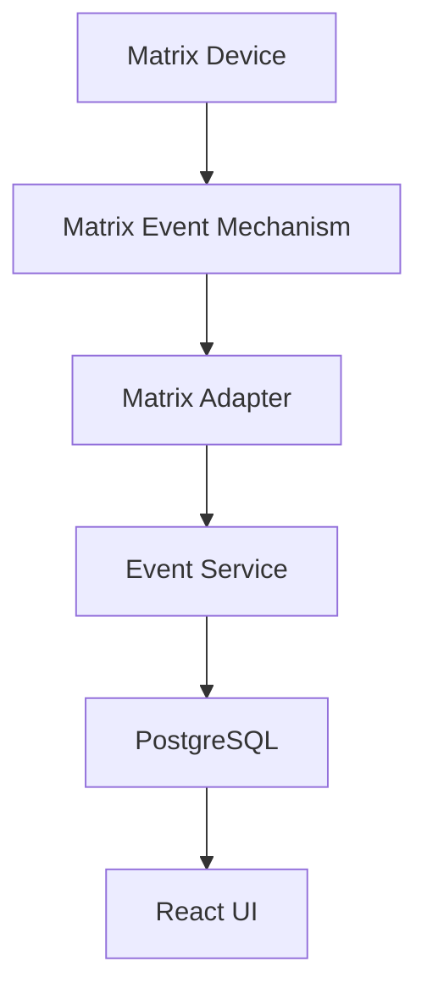

“Matrix Event Mechanism” means either:

- HTTP pull: `/device.cgi/events?action=getevent` with `roll-over-count` and `seq-number`
- TCP push: `/device.cgi/tcp-events?action=getevent` to a listener the application exposes

---

## H. Event recovery

The COSEC Devices API guide states that if a TCP event is missed, the third party must **re-request that event**. That recovery **must not** be done via the TCP port; missed events are re-requested through the **HTTP** event API.

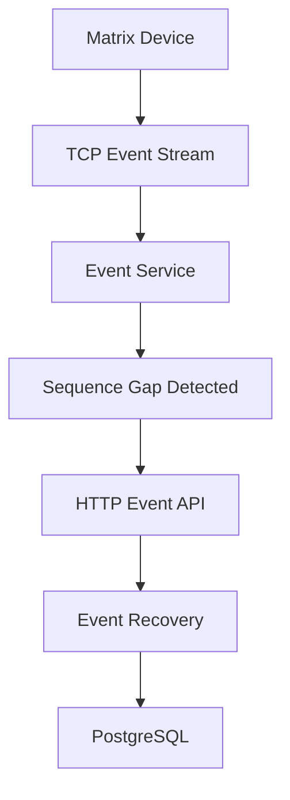

Events are identified with **sequence number** plus **roll-over count**. After a device reboot during TCP transfer, the API guide says the prior “send events” command is no longer valid and the client must re-request. Duplicate protection is an **application** concern (same seq + rollover + device).

---

## I. USB licensing

Separate from Matrix. See [licensing.md](licensing.md).

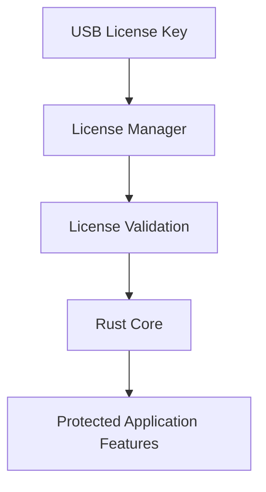

---

## J. Complete high-level flow

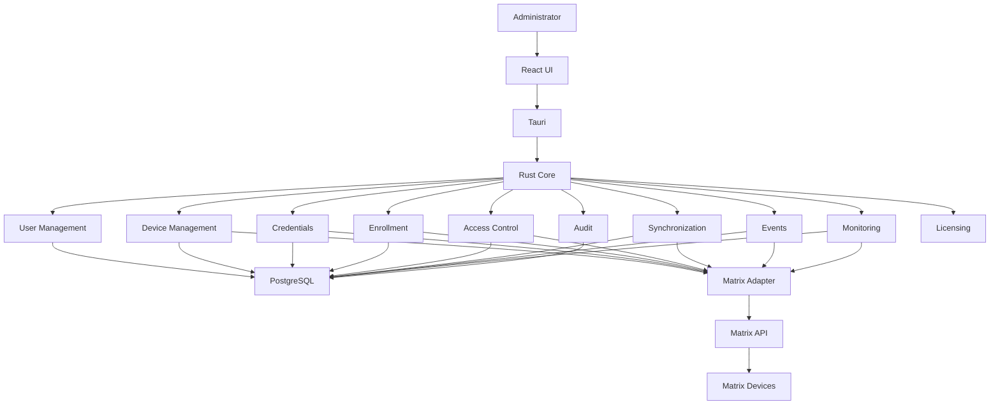

Licensing talks to the USB key, not to the Matrix adapter.

---

## Access at the door (not a desktop loop)

Do not assume the desktop application performs every real-time biometric match.

```text
Person presents credential
    → Matrix device performs the access operation
    → Access result occurs at the door
    → Device reports an event
    → Application stores the event
```

Command APIs (`lockdoor`, `opendoor`, `denyuser`, …) are **explicit operator/device commands**, not the same thing as an access event. See [events.md](events.md).
